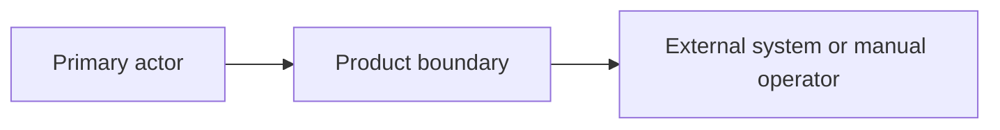

# Architecture

## Inputs

- **PRD:** [Path and status]
- **Existing baseline:** [Repository paths reviewed, or "Greenfield"]
- **Input exception:** [Builder-confirmed exception and its risk, or "None"]
- **Last evidence review:** [YYYY-MM-DD]

## Blockers

- [Open blocker, or "None"]

## Architectural drivers

| ID | Type | Priority | Driver and basis | Source | Implication |
| --- | --- | --- | --- | --- | --- |
| DRV-01 | [critical flow, quality attribute, constraint, or external dependency] | [high, medium, or low] | [Decision-relevant need] | [OUT, ASM, or named source] | [What the architecture must enable or avoid] |

## System shape

- **Chosen shape:** [Logical topology]
- **Rationale:** [How the shape satisfies the active drivers]
- **Deployable units:** [Each unit and its positive driver]
- **Interaction styles:** [Synchronous, asynchronous, batch, or manual]
- **Inside the product:** [Owned responsibilities]
- **Outside the product:** [People, manual work, and external systems]

## Boundaries

| Boundary | Responsibility and invariants | Owns data | Allowed dependencies | Drivers |
| --- | --- | --- | --- | --- |
| [Name] | [What must remain true] | [Data concepts it is the authority for] | [Other boundaries, or "None"] | [DRV IDs] |

## External integrations

| System | Purpose and direction | Trust boundary | Failure and recovery behavior | Drivers |
| --- | --- | --- | --- | --- |
| [Name] | [Purpose, inbound or outbound] | [Owner of trust and authorization] | [Required behavior] | [DRV IDs] |

## Technology stack

| Area | Selected technology | Role and boundary | Version or support policy | Drivers and ADRs | Primary evidence and date |
| --- | --- | --- | --- | --- | --- |
| [Runtime, framework, store, service, or tool] | [Named technology] | [Responsibility and deployable unit] | [Major version or supported channel] | [DRV and ADR IDs] | [Official source, YYYY-MM-DD] |

### Stack coherence

| Interaction | Compatibility evidence | Required constraint | Gap |
| --- | --- | --- | --- |
| [A to B] | [Official evidence] | [Version, protocol, or platform rule] | [Open gap, or "None"] |

### Lifecycle and operations

- **Local development and test:** [Required environment and test support]
- **Build and release:** [Mechanisms, at planning depth]
- **Observability:** [Capability and owner, or "None required"]
- **Data protection and recovery:** [Support for the approved rules, or "None required"]
- **Update and support policy:** [Cadence, support channel, and end-of-life response]
- **License and service constraints:** [Material license, residency, limit, or exit constraint, or "None"]

## Cross-cutting concerns

| Concern | Required rule | Owner | Driver | Gap |
| --- | --- | --- | --- | --- |
| [Identity, authorization, privacy, observability, resilience, performance, or operations] | [Confirmed rule] | [Boundary or role] | [DRV ID] | [Open gap, or "None"] |

## Decisions

### ADRs

| ADR | Decision | Status | Drivers | Important consequence |
| --- | --- | --- | --- | --- |
| [ADR-001 link] | [Summary] | [proposed or accepted] | [DRV IDs] | [Positive and negative consequence] |

### Local decisions

| Decision | Chosen option and reason | Credible alternative | Revisit trigger |
| --- | --- | --- | --- |
| [Reversible decision] | [Choice and driver-based reason] | [Alternative] | [Condition, or "None"] |

## Risks and validation

| Risk | Decision at risk | Validation action and expected evidence | Status |
| --- | --- | --- | --- |
| [Technical uncertainty] | [Decision or selection it can change] | [Smallest action and stopping condition] | [open, accepted, or resolved] |

## Manual and operational responsibilities

- [Responsibility that stays with a person, or "None"]
